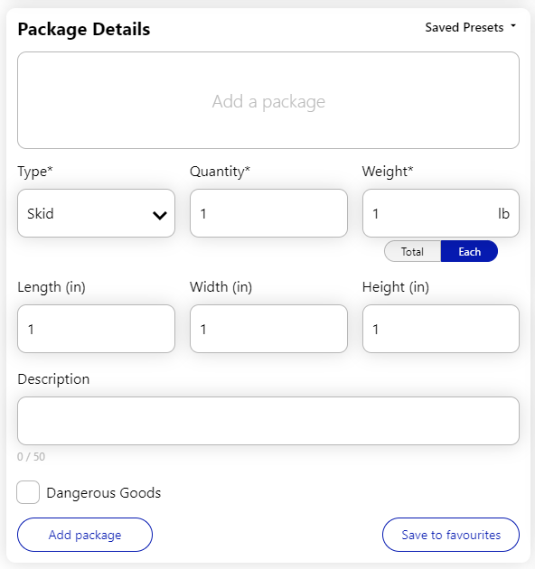

## v3.0.17

### New Features & Improvements

#### Consignee search improvements

Continuing on from our previous update, we've continued to refine our consignee search. You’ll now experience more accurate results when searching for consignees, ensuring you find exactly who you’re looking for with ease. We’ve also optimized the performance, so searches are faster and more responsive in most scenarios.

In addition to our existing `Name` (previously called `Default`) and `Unique ID` search methods, we've also added two new methods, `Address` and `Advanced`. These new search methods allow you to adjust the application to your workflow, instead of having to adjust your workflow around it.

- `Name` search has been greatly improved to more accurately rank relevant results higher.
- `Unique ID` search should be more performant.
- `Address` search allows you to lookup consignees by street line and/or postal code.
- `Advanced` search is a wildcard search that can find consignees by nearly any information, including all of the above but also contact names, email addresses, phone numbers and more. Though it's very flexible, due to its wide-reaching nature, performance is more variable and results might not always bring the expected results since it has a higher chance of matching across many different fields.

Experiment with the different search methods and chose which one works best for you.

#### Descriptions for freight packages

When adding packages to your freight shipment, you now have the ability to fill in an optional Description field. Whatever information you populate here will appear on your bill of lading.

### Fixes & Other Misc Changes

- Improved the reliability of bulk consignee import
- Improved residential address detection
- Fixed an issue that on rare occasions scheduled a pickup for the default sender instead of the currently selected sender
