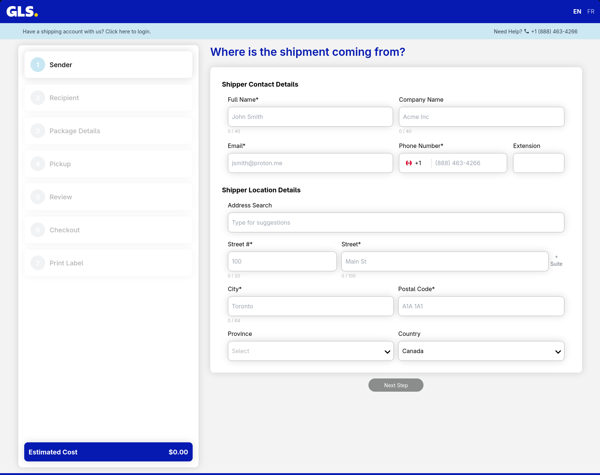

## v3.4.0

We're pleased to announce v3.4.0. This release that adds an important new way to ship and improves clarity around costs, customs, exports, and pickups. This update focuses on making one-off shipping simple, showing clearer pricing, handling customs more intuitively, and fixing a number of small annoyances.

### Guest Shipping

Ship without an account: guest shipping is now available!

Anyone can create and pay for a shipment without registering for an account, ideal for one-time shippers or quick drop-offs. Guests complete checkout using a secure, modern payment flow and receive confirmation and tracking updates by email.

### What's new?

- Unpaid bills now include a “Pay invoice” button so you can settle balances quickly and securely.
- Fuel charge percentage is now shown in rate estimates.
- A waybill filter makes it easier to find specific shipments in your account history.
- We now support EUR as a currency for international shipments.
- You can now edit products directly within the customs section of a shipment.
- New options available in settings:
    - Default to SNR for commercial shipments.
    - Hide tax in rate estimates.

### Misc Changes & Fixes

- When actual measured dimensions and weight are available, those values are shown instead for improved transparency.
- Fixed some international shipment validation regarding EORI numbers.
- Fixed an issue where customs details were not being correctly reset between shipments.
- Fixed an issue with special characters during consignee export.
- When toggling the selected language, the new option is now saved for future visits.
- Long sender and consignee names no longer break the layout.
- Fixed an issue where multiple billing reference types of the same type were allowed.
- Fixed an issue where the company name was sent instead of the contact name for pickups.
- Various small fixes and translation tweaks for a smoother experience.
